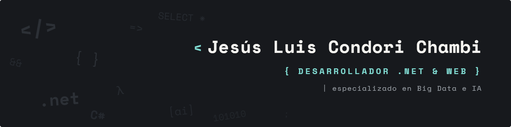

  

## 👋 Sobre mí

- 🔭 **Ahora mismo:** metido en un nuevo proyecto personal que me hace especial ilusión (pronto más)
- 🌱 **Especializado en:** Big Data e IA — Spark, Hadoop, Machine Learning y sistemas de datos
- 💻 **Mi día a día:** aplicaciones y backend con **.NET** y desarrollo **web**
- 🖥️ **Fuera del código:** self-hosting en mi homelab — Raspberry Pi, Docker, redes y servicios propios

 

## 🤝 Conecta conmigo

  
  

 

## 🧰 Tecnologías

**Backend & Web**

  
  
  
  
  
  
  
  
  
  

**Big Data & IA**

  
  
  
  
  
  
  
  
  
  
  
  
  
  
  

**Bases de datos**

  
  
  
  
  

**Móvil**

  
  
  

**DevOps & Homelab**

  
  
  
  
  
  
  
  
  
  
  
  
  
  
  
  

 

## 📌 Proyectos destacados

<table width="100%">
  <tr>
    <td width="50%" valign="top">
      <h3>🎬 <a href="https://github.com/jesus33lcc/DailyMovie">DailyMovie</a></h3>
      
App Android para descubrir y organizar películas. Proyecto Final del ciclo <b>DAM</b> (IES Comercio).

      

        
        
      

    </td>
    <td width="50%" valign="top">
      <h3>📚 <a href="https://github.com/jesus33lcc/NewGoodBook">NewGoodBook</a></h3>
      
App Android para gestionar y descubrir lecturas y libros.

      

        
        
      

    </td>
  </tr>
</table>

 

### ¡Gracias por pasarte por mi perfil!

